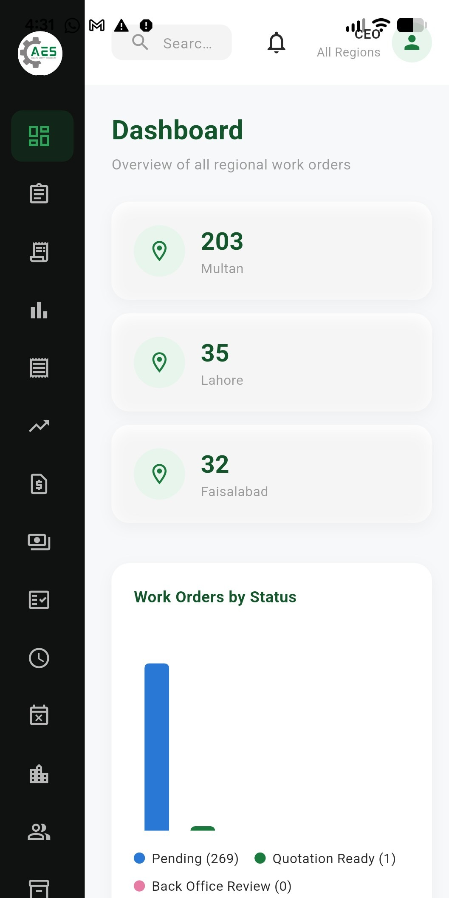
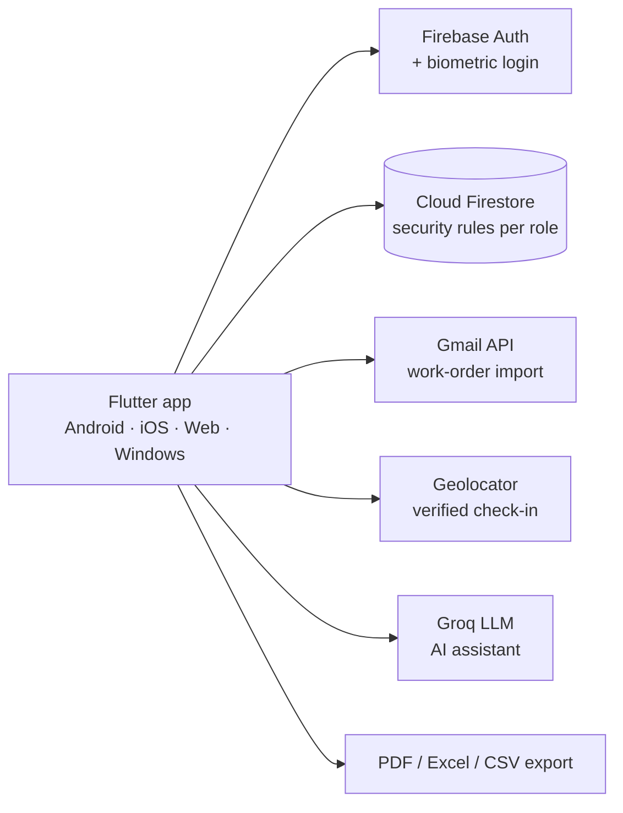

# AES App — Field Operations & Business Management Platform

[](https://github.com/saad92005/aes-app/actions/workflows/test.yml)

**One Flutter codebase that runs an engineering services company end to end: work orders, GPS attendance, payroll, double-entry accounting, inventory and role-based access for 12 roles.**



A cross-platform (Android, iOS, Web, Windows) internal business management app built for **Al-Areesh Engineering Solutions (AES)**, a facilities/engineering services company. Built with Flutter and Firebase.

## What it does

A single app covering the full operational and financial workflow for a multi-region engineering services company:

- **Work Orders** — Gmail-sync auto-import, manual creation, region/status tracking, assignment to employees/vendors, quotation generation and PDF/Excel export
- **Attendance** — GPS-verified check-in/check-out, per-role attendance reports, biometric login
- **Leave Management** — submission and multi-stage approval workflow
- **Payroll** — employee payroll profiles, configurable working schedules and calculation rules (hourly/daily rate, late/overtime deduction methods), a full Draft → Processing → Approved → Finalized → Paid processing workflow, payslip PDF generation, a payroll dashboard with charts, 9 exportable report types, a holiday calendar, and a full audit log
- **Finance & Accounting** — Chart of Accounts, Journal Entries, General Ledger, Trial Balance, Balance Sheet, P&L, customer invoicing and receipts
- **Inventory** — stock tracking, tool assignments, transaction history
- **Expenses & Vendor Bills** — two-stage approval workflow
- **Role-based access control** — 12 distinct roles (CEO, Operational Manager, Finance, HSSE, BDM/HR, Store Manager, field employees, vendors, etc.), each with a tailored set of permissions and nav items
- **AI Assistant** — a Groq-backed chat assistant scoped to the signed-in user's own visible data, called through an n8n proxy so no API key ships in the app

## Architecture



## Tech stack

- **Flutter** (single-codebase multi-platform: Android, iOS, Web, Windows)
- **Firebase** — Firestore (data), Firebase Auth (login), Firebase Hosting (web)
- **Google Sign-In / Gmail API** — automated work order ingestion from a shared mailbox
- **fl_chart** — dashboard charts
- **pdf / excel / share_plus** — in-app report and payslip export (PDF/Excel/CSV)

## Project structure

This app uses a single-library architecture: every screen/model/service file is a `part of '../main.dart'` file, all registered via `part` declarations in `lib/main.dart`. This keeps the whole app as one compilation unit without needing a state management library for cross-screen data access — shared in-memory lists (kept in sync with Firestore) are simply top-level variables any file can read.

```
lib/
  main.dart              # entry point + part registrations
  models/                # data models (WorkOrder, PayrollRecord, AppUser, ...)
  screens/                # one file per screen
  services/               # DataService (Firestore), AuthService, PayrollEngine, ExportService, ...
  widgets/                # shared UI components
```

## Known technical debt

Written down honestly for anyone reviewing the code:

- **Single compilation unit.** Every file is a `part of` `main.dart` and shares top-level state. This was fast to build, but it couples features together. A feature-based layout with a state-management layer (Riverpod or Bloc) is the planned refactor.
- **AI proxy caller verification.** The assistant now goes through an n8n proxy, so no key ships in the app (see [n8n/README.md](n8n/README.md)). The proxy does not yet verify the Firebase ID token the app sends.
- **Test coverage.** The payroll engine has unit tests covering attendance, leave, lateness, overtime, holidays and deduction rules. Accounting and the UI do not have tests yet.

## Testing

```bash
flutter test
```

`test/payroll_engine_test.dart` checks the payroll engine end to end on a fixed month: a perfect month, absences, paid and unpaid leave, the grace period, per-minute and progressive late deductions, overtime eligibility, early checkout, joining mid-month, mid-month runs, public holidays and the zero floor on net salary.

## Running this yourself

This is a showcase copy — the real Firebase project credentials have been replaced with placeholders (`lib/firebase_options.dart`, `android/app/google-services.json`, `ios/Runner/GoogleService-Info.plist`, `macos/Runner/GoogleService-Info.plist`) and no API key is included. To run it against your own backend:

1. Create a Firebase project and run `flutterfire configure` to regenerate `lib/firebase_options.dart` and the platform config files with your own project's real values.
2. Deploy `firestore.rules` to your project.
3. (Optional) To enable the AI Assistant, import the n8n proxy ([n8n/README.md](n8n/README.md)) and build with `--dart-define=AI_PROXY_URL=<webhook url>`.
4. `flutter pub get`
5. `flutter run`

## License

Proprietary — built for internal use at Al-Areesh Engineering Solutions. Shared here as a portfolio/showcase of the work.
